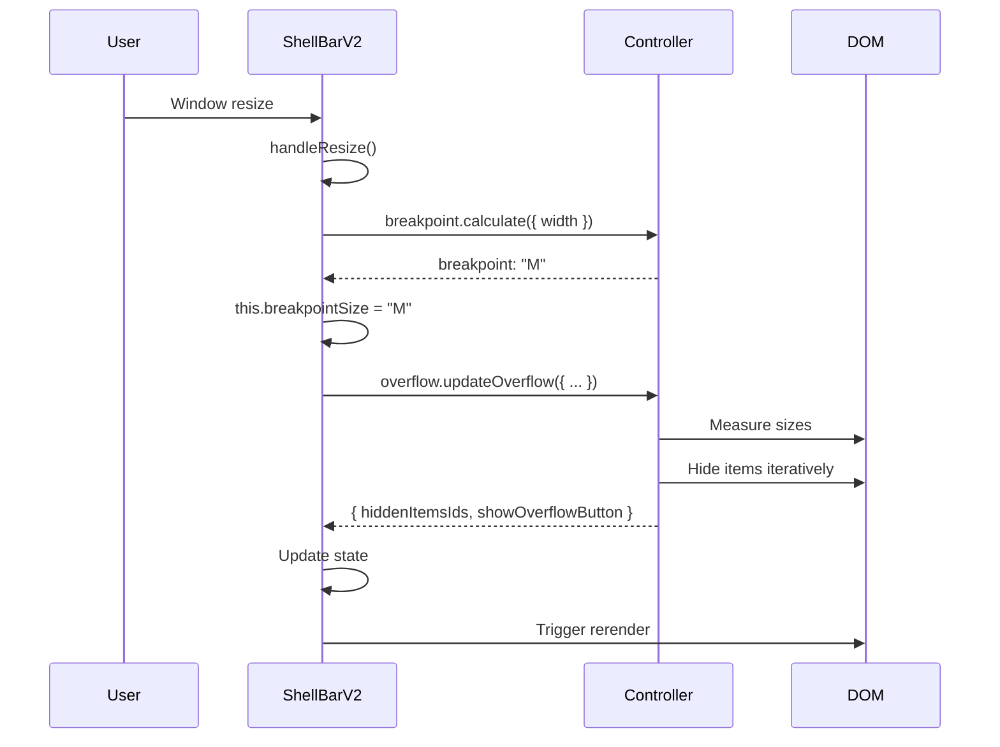
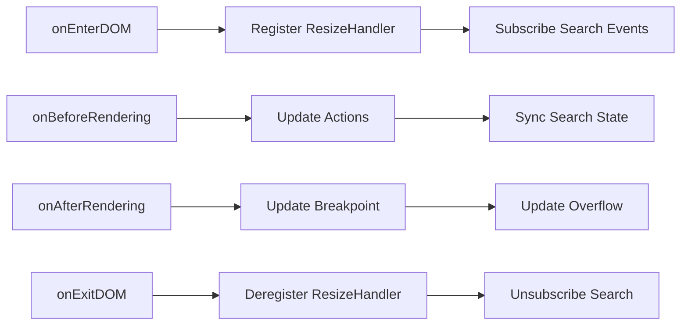
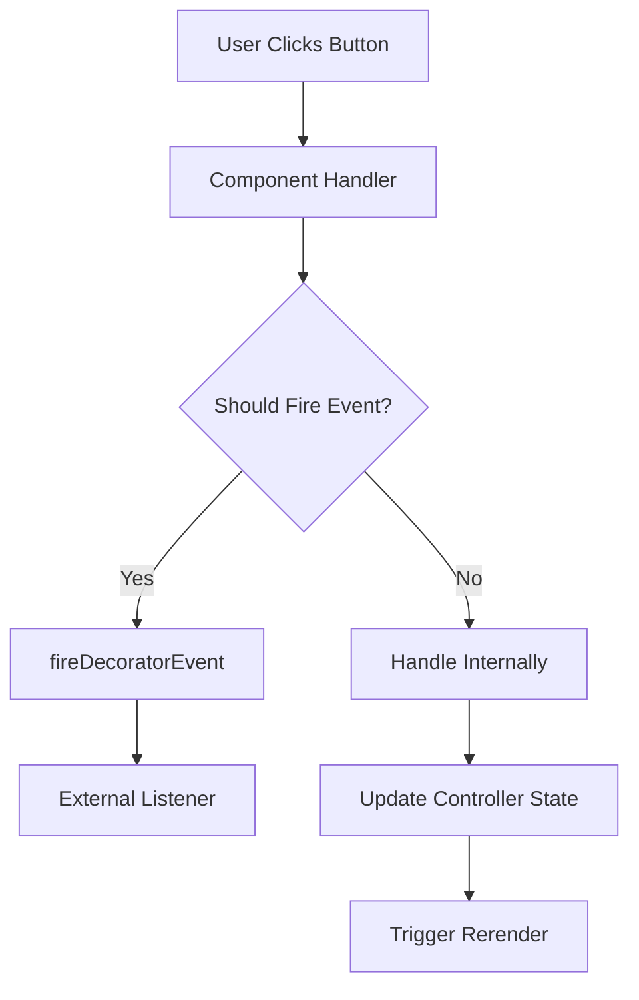

# ShellBarV2 Architecture

## Overview

ShellBarV2 is a modular application header component built with a clean separation of concerns. The main component delegates business logic to specialized controller classes, keeping the component focused on coordination and rendering.

## Core Principles

1. **Separation of Concerns** - Component coordinates, controllers compute
2. **No Side Effects in Controllers** - Controllers are pure logic classes
3. **Explicit Data Flow** - All data passed explicitly as parameters
4. **Single Responsibility** - Each controller handles one concern

## Architecture Pattern

The architecture follows a **Component-Controller** pattern:

- **ShellBarV2** (Component) - Coordinates controllers, manages state, handles DOM
- **Controllers** - Pure logic classes that compute results from input parameters

```
┌─────────────────────────────────────────────────────────┐
│                      ShellBarV2                         │
│                     (Coordinator)                       │
│                                                         │
│  • Manages component state                             │
│  • Delegates logic to controllers                      │
│  • Applies controller results                          │
│  • Handles DOM and events                              │
│  • Fires external events                               │
└─────────────────────────────────────────────────────────┘
                           │
           ┌───────────────┼───────────────┐
           │               │               │
           ▼               ▼               ▼
    ┌──────────┐    ┌──────────┐   ┌──────────┐
    │Controller│    │Controller│   │Controller│
    │  (Logic) │    │  (Logic) │   │  (Logic) │
    └──────────┘    └──────────┘   └──────────┘
```

## Component Structure

```mermaid
graph TB
    subgraph "Main Component"
        ShellBarV2[ShellBarV2<br/>Main Component]
    end
    
    subgraph "Controllers - Pure Logic"
        Breakpoint[ShellBarBreakpoint<br/>Responsive breakpoints]
        Actions[ShellBarActions<br/>Action items management]
        Content[ShellBarContent<br/>Content grouping & separators]
        Overflow[ShellBarOverflow<br/>Overflow calculation]
        Search[ShellBarSearch<br/>Search field behavior]
        ItemNav[ShellBarItemNavigation<br/>Keyboard navigation]
        A11y[ShellBarAccessibility<br/>ARIA attributes]
    end
    
    subgraph "Child Components"
        Item[ShellBarV2Item<br/>Custom action item]
        Branding[ShellBarBranding<br/>Logo + title]
        Spacer[ShellBarSpacer<br/>Content separator]
    end
    
    subgraph "External Dependencies"
        Button[ui5-button]
        Icon[ui5-icon]
        Popover[ui5-popover]
        List[ui5-list]
    end
    
    ShellBarV2 --> Breakpoint
    ShellBarV2 --> Actions
    ShellBarV2 --> Content
    ShellBarV2 --> Overflow
    ShellBarV2 --> Search
    ShellBarV2 --> ItemNav
    ShellBarV2 --> A11y
    
    ShellBarV2 --> Item
    ShellBarV2 --> Branding
    ShellBarV2 --> Spacer
    
    ShellBarV2 --> Button
    ShellBarV2 --> Icon
    ShellBarV2 --> Popover
    ShellBarV2 --> List
    
    style ShellBarV2 fill:#e1f5ff
    style Breakpoint fill:#fff4e6
    style Actions fill:#fff4e6
    style Content fill:#fff4e6
    style Overflow fill:#fff4e6
    style Search fill:#fff4e6
    style ItemNav fill:#fff4e6
    style A11y fill:#fff4e6
```



## Controller Responsibilities

### ShellBarBreakpoint
**Purpose:** Calculate responsive breakpoint based on component width

**Method:** `calculate(params)`
- Input: `{ width: number }`
- Output: `"S" | "M" | "L" | "XL" | "XXL"`
- Logic: Maps width to breakpoint thresholds (599, 1023, 1439, 1919px)

### ShellBarActions
**Purpose:** Build list of action items from component state

**Method:** `getActions(params)`
- Input: `{ showNotifications, notificationsCount, showProductSwitch, hasAssistant, showProfile }`
- Output: Array of `ShellBarV2ActionItem`
- Logic: Filters visible actions based on boolean flags

**Data Structure:**
```typescript
{
  id: string,
  icon?: string,
  count?: string,
  visible: boolean
}
```

### ShellBarContent
**Purpose:** Handle content area splitting and separator visibility

**Methods:**

1. `splitContent(content)`
   - Splits content into start/end groups using spacer element
   - Items before spacer → start (left-aligned)
   - Items after spacer → end (right-aligned)

2. `getSeparatorConfig(params)`
   - Calculates separator visibility between content groups
   - Hides on S breakpoint

3. `shouldPackSeparator(item, group, hiddenIds, isSBreakPoint)`
   - Determines if separator should hide with last visible item

4. `getContentRole(content)`
   - Returns "group" role when multiple content items exist

### ShellBarOverflow
**Purpose:** Calculate which items should hide due to space constraints

**Method:** `updateOverflow(params)`
- Input: `{ actions, content, customItems, overflowOuter, overflowInner, hiddenItemsIds, showSearchField, setVisible }`
- Output: `{ hiddenItemsIds: string[], showOverflowButton: boolean }`
- Logic: 
  1. Build sorted list of hidable items by priority
  2. Show all items initially
  3. Iteratively hide items until no overflow
  4. Measure DOM after each hide

**Hide Priority (lower = hide first):**
1. Content items (10-99) - Just disappear
2. Search button (100) - Shows in overflow
3. Notifications (101) - Shows in overflow
4. Assistant (102) - Shows in overflow
5. Custom items (103+) - Show in overflow
6. Product switch (999) - Protected, never hides
7. Profile (1000) - Protected, never hides

**Method:** `getOverflowItems(params)`
- Returns list of hidden items for overflow popover
- Sorted by order for consistent display

### ShellBarSearch
**Purpose:** Manage search field expand/collapse behavior

**Constructor Dependencies:**
- `getOverflowed()` - Check if shellbar is overflowing
- `getSearchState()` - Get current expanded state
- `setSearchState(expanded)` - Update expanded state
- `getSearchField()` - Get search field element
- `getCSSVariable(name)` - Read CSS variable value

**Methods:**

1. `subscribe()` / `unsubscribe()`
   - Listen to search field events (ui5-open, ui5-close, ui5-search)
   - Syncs component state with self-collapsible search

2. `autoManageSearchState(hiddenItems, availableSpace)`
   - Auto-collapse search when items overflow
   - Auto-expand when space becomes available
   - Prevents collapse if search has focus or value

3. `syncShowSearchFieldState()`
   - Applies component state to search field
   - Handles phone vs desktop behavior

4. `shouldShowFullScreen()`
   - Returns true if search should be full-screen
   - Activates when overflowed AND search is visible

### ShellBarItemNavigation
**Purpose:** Handle keyboard navigation (Arrow keys, Home, End)

**Method:** `handleKeyDown(e)`
- Intercepts Left/Right/Home/End keys
- Finds tabbable elements in shellbar
- Moves focus between items
- Respects input cursor position

**Smart Navigation:**
- Skips navigation inside input fields when cursor can move
- Only navigates when at input boundaries

### ShellBarAccessibility
**Purpose:** Compute ARIA attributes for interactive areas

**Method:** `getAccessibilityInfo(params)`
- Input: `{ accessibilityAttributes, overflowPopoverOpen, *Text }`
- Output: Accessibility info for all areas
- Logic: Merges user-provided attributes with defaults

**Method:** `getActionsRole(visibleItemsCount)`
- Returns "toolbar" role when multiple actions visible
- Improves screen reader navigation

## Data Flow



## Lifecycle Flow



## Key Design Decisions

### Why Controllers?

**Before (Anti-pattern):**
```typescript
// Component has complex calculation logic
onAfterRendering() {
  const width = this.getBoundingClientRect().width;
  let breakpoint = "S";
  if (width > 599) breakpoint = "M";
  if (width > 1023) breakpoint = "L";
  // ... more logic ...
}
```

**After (Clean pattern):**
```typescript
// Component delegates to controller
onAfterRendering() {
  const width = this.getBoundingClientRect().width;
  this.breakpointSize = this.breakpoint.calculate({ width });
}
```

**Benefits:**
- Component stays focused on coordination
- Controllers are testable without DOM
- Logic is reusable across components
- Clear separation of concerns

### Why Explicit Parameters?

Controllers receive all data explicitly as parameters:

```typescript
// Good - explicit dependencies
overflow.updateOverflow({
  actions: this.actions,
  content: this.content,
  customItems: this.items,
  overflowOuter: this.overflowOuter,
  overflowInner: this.overflowInner,
  // ...
});

// Bad - implicit dependencies
overflow.updateOverflow(); // What does it need? Unknown!
```

**Benefits:**
- Easy to trace data flow
- No hidden dependencies
- Controllers remain pure
- Testable with simple mocks

### Why No Side Effects in Controllers?

Controllers compute and return results but never modify state directly:

```typescript
// Good - returns result
const result = controller.calculate(params);
this.state = result;

// Bad - modifies state directly
controller.calculate(params); // Changed state inside!
```

**Benefits:**
- Predictable behavior
- Easy to test
- No race conditions
- Clear ownership of state

## Component Coordination Examples

### Example 1: Breakpoint Update

```typescript
private updateBreakpoint() {
  // 1. Gather data
  const width = this.getBoundingClientRect().width;
  
  // 2. Delegate to controller
  const breakpoint = this.breakpoint.calculate({ width });
  
  // 3. Apply result
  if (this.breakpointSize !== breakpoint) {
    this.breakpointSize = breakpoint;
  }
}
```

### Example 2: Overflow Calculation

```typescript
private updateOverflow() {
  // 1. Gather all required data
  const result = this.overflowAdaptor.updateOverflow({
    actions: this.actions,
    content: this.content,
    customItems: this.items,
    overflowOuter: this.overflowOuter!,
    overflowInner: this.overflowInner!,
    hiddenItemsIds: this.hiddenItemsIds,
    showSearchField: this.showSearchField,
    // 2. Pass DOM manipulation callback
    setVisible: (selector, visible) => {
      const element = this.shadowRoot!.querySelector(selector);
      if (element) {
        element.classList[visible ? "remove" : "add"]("ui5-shellbar-hidden");
      }
    },
  });
  
  // 3. Apply result to state
  this.hiddenItemsIds = result.hiddenItemsIds;
  this.showOverflowButton = result.showOverflowButton;
}
```

### Example 3: Search State Management

```typescript
// Component provides callbacks to controller
searchAdaptor = new ShellBarV2Search({
  getSearchField: () => this.search,
  getSearchState: () => this.showSearchField,
  setSearchState: (expanded) => this.setSearchState(expanded),
  getCSSVariable: (cssVar) => this.getCSSVariable(cssVar),
  getOverflowed: () => this.overflowAdaptor.isOverflowing(...),
});

// Controller uses callbacks to coordinate behavior
autoManageSearchState(hiddenItems, availableSpace) {
  if (hiddenItems > 0) {
    this.setSearchState(false); // Collapse
  } else if (availableSpace > threshold) {
    this.setSearchState(true); // Expand
  }
}
```

## Event Flow



## File Structure

```
packages/fiori/src/
├── ShellBarV2.ts                    # Main component
├── ShellBarV2Item.ts                # Custom item component
├── ShellBarBranding.ts              # Branding component
├── ShellBarSpacer.ts                # Spacer component
└── shellbarv2/
    ├── README.md                    # This file
    ├── ShellBarBreakpoint.ts        # Breakpoint controller
    ├── ShellBarActions.ts           # Actions controller
    ├── ShellBarContent.ts           # Content controller
    ├── ShellBarOverflow.ts          # Overflow controller
    ├── ShellBarSearch.ts            # Search controller
    ├── ShellBarItemNavigation.ts   # Navigation controller
    └── ShellBarAccessibility.ts    # Accessibility controller
```

## Testing Strategy

Controllers are pure logic classes, easy to unit test:

```typescript
// Test breakpoint calculation
const breakpoint = new ShellBarBreakpoint();
expect(breakpoint.calculate({ width: 500 })).toBe("S");
expect(breakpoint.calculate({ width: 600 })).toBe("M");

// Test actions building
const actions = new ShellBarActions();
const result = actions.getActions({
  showNotifications: true,
  notificationsCount: "5",
  showProductSwitch: false,
  hasAssistant: false,
  showProfile: true,
});
expect(result).toHaveLength(2);
expect(result[0].id).toBe("notifications");
expect(result[1].id).toBe("profile");
```

No DOM needed, no mocking, just pure function testing.

## Common Patterns

### Pattern 1: Controller Instantiation

Controllers are instantiated as component properties:

```typescript
class ShellBarV2 extends UI5Element {
  // Simple controllers
  breakpoint = new ShellBarV2Breakpoint();
  contentAdaptor = new ShellBarV2Content();
  actionsAdaptor = new ShellBarV2Actions();
  
  // Controllers with dependencies
  searchAdaptor = new ShellBarV2Search({
    getSearchField: () => this.search,
    getSearchState: () => this.showSearchField,
    setSearchState: (expanded) => this.setSearchState(expanded),
    // ...
  });
}
```

### Pattern 2: Computed Properties Using Controllers

```typescript
get accInfo() {
  return this.accessibilityAdaptor.getAccessibilityInfo({
    accessibilityAttributes: this.accessibilityAttributes,
    overflowPopoverOpen: this.overflowPopoverOpen,
    notificationsText: this._notificationsText,
    // ...
  });
}

get separatorConfig() {
  return this.contentAdaptor.getSeparatorConfig({
    content: this.content,
    isSBreakPoint: this.isSBreakPoint,
    hiddenItemIds: this.hiddenItemsIds,
  });
}
```

### Pattern 3: State Update After Controller Calculation

```typescript
private handleResize() {
  // Close overflow popover
  this.overflowPopoverOpen = false;
  
  // Update breakpoint
  this.updateBreakpoint();
  
  // Update overflow (returns new hidden items)
  const hiddenItemsIds = this.updateOverflow() ?? [];
  
  // Auto-manage search based on overflow state
  const spacerWidth = this.spacer?.getBoundingClientRect().width || 0;
  this.searchAdaptor.autoManageSearchState(hiddenItemsIds.length, spacerWidth);
}
```

## Extending the Component

### Adding a New Controller

1. Create controller class in `shellbarv2/` folder
2. Export types and interfaces
3. Instantiate in ShellBarV2 component
4. Call controller methods where needed
5. Apply results to component state

Example:

```typescript
// shellbarv2/ShellBarNewFeature.ts
interface NewFeatureParams {
  input: string;
}

class ShellBarNewFeature {
  compute(params: NewFeatureParams): string {
    return params.input.toUpperCase();
  }
}

export default ShellBarNewFeature;

// ShellBarV2.ts
import ShellBarNewFeature from "./shellbarv2/ShellBarNewFeature.js";

class ShellBarV2 extends UI5Element {
  newFeatureController = new ShellBarNewFeature();
  
  someMethod() {
    const result = this.newFeatureController.compute({ input: "test" });
    console.log(result); // "TEST"
  }
}
```

### Adding a New Action

Actions are controlled by `ShellBarActions` controller. To add a new action:

1. Add boolean property to component
2. Update `ShellBarV2ActionsParams` interface
3. Update `getActions()` in `ShellBarActions.ts`
4. Add handler method in component
5. Update template to render action

## Debugging Tips

### Trace Data Flow

Enable logging in controllers:

```typescript
updateOverflow(params) {
  console.log('[Overflow] Input:', params);
  const result = { /* ... */ };
  console.log('[Overflow] Output:', result);
  return result;
}
```

### Check State Updates

Use breakpoints in component lifecycle methods:

```typescript
onAfterRendering() {
  console.log('Breakpoint:', this.breakpointSize);
  console.log('Hidden items:', this.hiddenItemsIds);
  console.log('Actions:', this.actions);
  this.updateBreakpoint();
  this.updateOverflow();
}
```

### Verify Controller Logic

Test controllers in isolation:

```typescript
// In browser console
const controller = new ShellBarBreakpoint();
controller.calculate({ width: 500 }); // Test different widths
```

## Performance Considerations

1. **Overflow calculation** - Runs on every resize
   - Uses iterative hide approach (shows all, then hides until fits)
   - Measures DOM after each hide
   - Optimized by maintaining hidden items state

2. **Breakpoint update** - Runs on every resize
   - Simple threshold lookup, very fast
   - Only triggers rerender if breakpoint changed

3. **Search auto-manage** - Runs on resize
   - Quick measurements, minimal DOM reads
   - Prevents unnecessary state changes

## Summary

ShellBarV2 demonstrates a clean architecture where:

- **Component** coordinates and renders
- **Controllers** compute and return results
- **Data flows** explicitly through parameters
- **State lives** only in the component
- **Logic is** pure and testable

This pattern makes the code maintainable, testable, and easy to understand.


